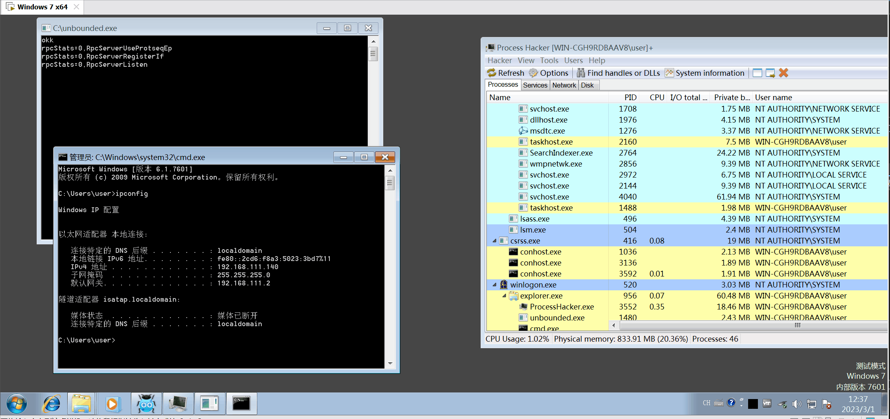

## 这是什么
1. 基于脚本 (Lua) 控制逻辑的应用层通用HOOK框架
2. 针对(不限于)应用层的通用HOOK处理，以便监控应用程序行为
3. 你可以将它认为是Lua版的Frida

## 设计方案

基于LuaJIT ( http://luajit.org/ ) 作为 业务层处理 逻辑。
特性

* 任意函数挂钩

* 通用参数解析

* 脚本操作原生数据，结构体


## 介绍
- [x] Windows Hook框架，通过编写Lua脚本处理hook点逻辑 
- [x] 用脚本实现了Dcom 远程服务 远程WMI等的监控拦截功能
- [x] 使用pool轮询方式保证Hook点处并发性能
- [x] 框架大概有三部分构成：Agent端`luapatch`(要注入的监控进程的), Script(业务逻辑), 一个服务进程`unbounded`(与Agent所在进程通信用的，简单的windows RPC实现) 
- [x] 里面包含了一系列针对 `https://github.com/y11en/lm_tools` 项目的检测(拦截)方案 ;)
- [x] hook点以`pre`操作为主，当然要实现post的话也不难，修改hook点的shellcode先调用原函数，然后将结果传回给脚本进行处理即可 -> pre_hook -> call func -> post_hook，你会问怎么接管call func的返回啊？替换栈上的返回地址啊！🤣 

## 调用任意 Native 函数

举例

以 hook 'CreateProcessA' 为例，

1. 获取函数地址

`ntapi.CreateProcessA = ffi.C.GetProcAddress(k32, 'CreateProcessA')`

2. HOOK函数

`install_hook(ntapi.CreateProcessA)`

3. 编写HOOK点函数处理逻辑

```lua
local hook_CreateProcessA = function(regs, stack, ctx)
    local args_num = 10
    local args = parse_stdcall_args(regs, stack, args_num)
    if #args == 10 then
        local arg2 = ffi.cast("char *", args[2])
        dump_args('CreateProcessA', args[1], ffi.string(arg2), args[3], args[4], args[5], args[6], args[7], args[8],
            args[9], args[10])
        dump_stack(regs, ctx, 'CreateProcessA')
    end
end
```

4. 以远程线程注入为例，当执行该函数时，dump出远程线程起始位置所在页的内存

```lua
local hook_CreateRemoteThread = function(regs, stack, ctx)
    local args_num = 7
    -- 获取函数预调用参数
    local args = parse_stdcall_args(regs, stack, args_num)
    if #args == args_num then
        dump_args('CreateRemoteThread', args[1], args[2], args[3], args[4], args[5], args[6], args[7])
        local buflen = ffi.new("uintptr_t[1]") -- 搞个指针出来
        local alloc_size = 0x1000

        dump_stack(regs, ctx)

        -- 动态申请内存，保存shellcode
        local p = ffi.gc(stdapi.malloc(alloc_size), stdapi.free)
        local target_addr = bit.band(args[4], 0xFFFFFFFFFFFFF000)

        -- 查看远程执行的内存数据是什么
        -- 通过ReadProcessMemory把远程准备执行的数据转储下来
        print(args[1], args[4], p, alloc_size, buflen)
        if ffi.C.ReadProcessMemory(ffi.cast('HANDLE', args[1]), ffi.cast('intptr_t', target_addr),
            ffi.cast('intptr_t', p), ffi.cast('intptr_t', alloc_size), buflen) then
            DbgPrint('-Dump ShellCode BEG-')
            -- 可以进一步判断是什么类型shellcode
            dump_memory(p, alloc_size, 64)
            DbgPrint('-Dump ShellCode END-')
        end
        -- 通过lua gc机制释放内存
        p = nil
    end
end

```

5. lua 调用 native 函数

```lua
-- 获取地址
WinExec = ffi.C.GetProcAddress(ffi.cast('intptr_t*', ffi.C.LoadLibraryA('kernel32.dll')), 'WinExec')
-- 调用函数
WinExec("calc.exe", 0)

```

演示


